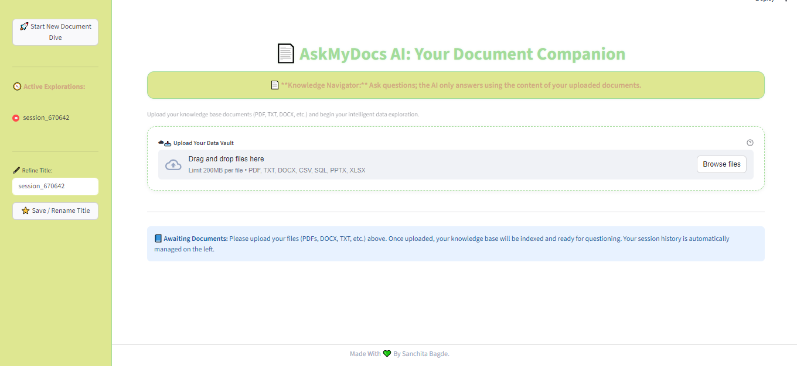
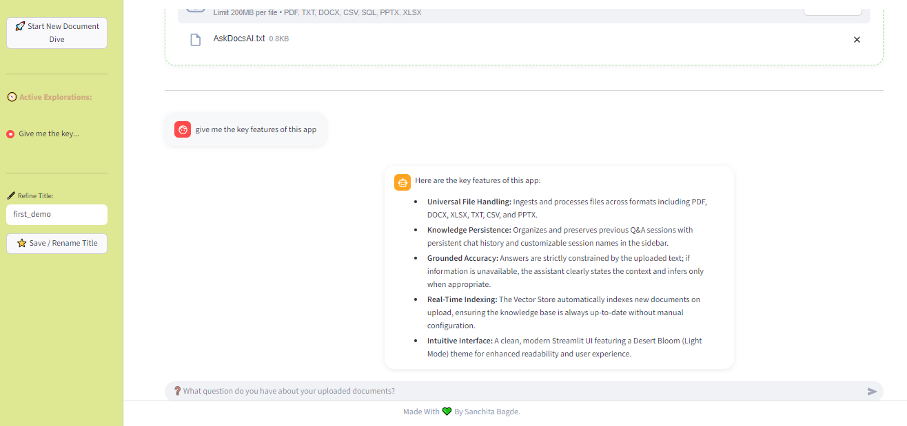

📚 AskMyDocsAI: The Universal Document RAG Assistant

Unlock the knowledge in your files. A powerful, multi-format AI chat solution for instantaneous, grounded answers.

✨ Project Summary

AskMyDocsAI transforms scattered business and academic documents into a single, interactive knowledge base. This application leverages Retrieval-Augmented Generation (RAG) to provide highly accurate, context-bound responses from any combination of supported files.

It's not just a PDF reader—it's your AI research assistant, designed for efficiency, clarity, and precision, powered by the Gemini LLM.

🚀 Key Capabilities

Universal File Handling: Seamlessly ingest and process files across formats: PDF, DOCX, XLSX, TXT, CSV, and PPTX.

Knowledge Persistence: Organize and preserve previous Q&A sessions with persistent chat history and customizable session names in the sidebar.

Grounded Accuracy: Answers are strictly constrained by the uploaded text. If information is unavailable, the assistant clearly states the context and infers only when appropriate.

Real-Time Indexing: The Vector Store automatically indexes new documents on upload, ensuring your knowledge base is always up-to-date without manual configuration.

Intuitive Interface: A clean, modern Streamlit UI featuring a Desert Bloom (Light Mode) theme for enhanced readability and user experience.

🏗️ Technical Architecture

The system utilizes a classic RAG framework to ensure responses are factual and sourced directly from your documents.

┌─────────────────────────────────────┐
│           STREAMLIT APP             │
│   → User interaction layer          │
└──────────────────┬──────────────────┘
                   │
                   ▼
┌─────────────────────────────────────┐
│        LANGCHAIN RAG PIPELINE       │
│   → Retrieve → Prompt → Generate    │
└──────────────────┬──────────────────┘
                   │
                   ▼
┌─────────────────────────────────────┐
│       FAISS VECTOR DATABASE         │
│   → Stores and retrieves embeddings │
│   → Uses HuggingFace models         │
└─────────────────────────────────────┘

⚙️ Core Technology Stack

Component

Technology

Description

Frontend

Streamlit

Rapid development and deployment of the web interface.

LLM Integration

Gemini

The primary large language model powering the chat.

Document Processing

LangChain & Unstructured

Handles document loading, parsing, and text splitting for multiple file types.

Embeddings

HuggingFace Sentence Transformers

Converts text chunks into numerical vectors for similarity search.

Vector Storage

FAISS (CPU)

High-performance, memory-efficient index for vector lookups.

State Management

Streamlit & history_manager

Persists user sessions, chat history, and application state.

💾 Installation & Quick Start

1️⃣ Environment Setup

Create and activate a Python virtual environment to manage dependencies:

python -m venv venv
source venv/bin/activate # On Mac/Linux
# OR
venv\Scripts\activate    # On Windows

2️⃣ Install Dependencies

This project requires core RAG libraries and file-specific parsers (unstructured, python-docx, etc.) for multi-format support.

pip install -r requirements.txt

3️⃣ Configure API Key

Create a file named .env in the project root and add your chosen LLM API key:

GEMINI_API_KEY=your_api_key_here

4️⃣ Launch the Application

streamlit run app.py

Open your browser and navigate to http://localhost:8501/.

💬 Interaction Example

The system is trained to prioritize and cite the context, providing clear boundaries on its knowledge.

🧩 Project Structure — AskMyDocsAI

├── app.py                  # 🎯 Streamlit app entry point
├── rag_pipeline.py         # ⚙️ RAG logic (Retrieve → Prompt → Generate)
├── vectorstore_manager.py  # 🧠 FAISS index + Embeddings
├── chat_gemini.py          # 🤖 Gemini API wrapper
├── session_manager.py      # 💬 Chat session management
├── history_manager.py      # 🗂️ Save/load conversation history
├── data/                   # 📁 Uploaded document storage
└── requirements.txt        # 📦 Dependencies list

